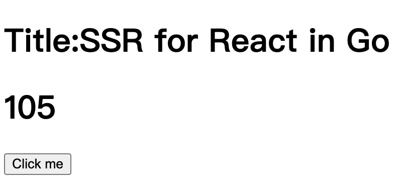

## SSR React using Go



## What this is

just a poc for ssring react components using Go.

## How to run it

run the command below and go to `http://localhost:3002`.

```
go generate
go run main.go
```